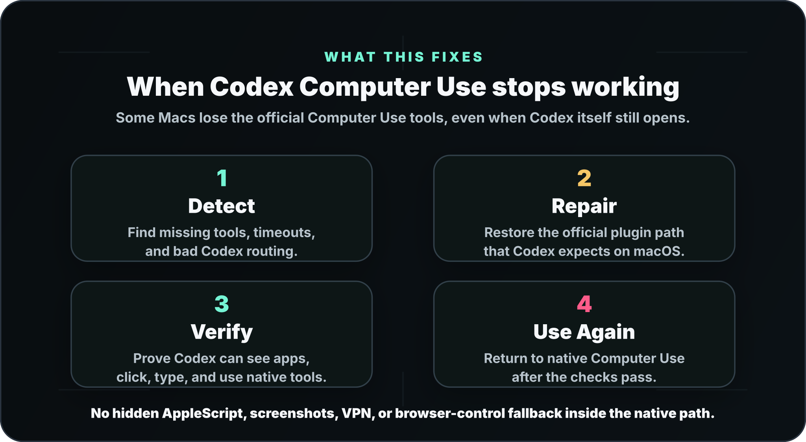

<h1 align="center">Codex Computer Use Foundation</h1>

<p align="center">
  <strong>Fix native OpenAI Codex Computer Use when it is missing or broken on macOS.</strong><br />
  Use this when Codex opens normally, but Computer Use tools do not appear,
  time out, or cannot control Mac apps.
</p>

<p align="center">
  <a href="#quick-install">Quick Install</a>
  &nbsp;&nbsp;|&nbsp;&nbsp;
  <a href="docs/INSTALL.md">Install Guide</a>
  &nbsp;&nbsp;|&nbsp;&nbsp;
  <a href="docs/RUNBOOK.md">Runbook</a>
  &nbsp;&nbsp;|&nbsp;&nbsp;
  <a href="SECURITY.md">Security</a>
</p>

<p align="center">
  
</p>

## Why This Exists

Codex Computer Use should let Codex inspect the Mac desktop, list apps, click,
type, scroll, drag, and press keys through the official native OpenAI Computer
Use plugin.

On some Macs that native path breaks. Codex itself may still launch, but the
Computer Use tools are missing, hidden, timing out, returning transport errors,
or failing in fresh threads. The result is confusing: Codex looks installed,
but it cannot actually control apps through native Computer Use.

Codex Computer Use Foundation repairs that local Codex routing and validates
that the official native path works again. It does not replace Codex, patch the
Codex app bundle, bypass macOS privacy permissions, or hide AppleScript,
screenshots, browser automation, Keyboard Maestro, `cliclick`, or VPN as fake
Computer Use.

## What This Project Does

| Step | Plain-English Result |
| --- | --- |
| Detect | Finds broken Computer Use discovery, disabled bundled plugin state, stale clients, bad shims, and duplicate MCP routing. |
| Repair | Restores the official Codex Computer Use plugin path under the current user's `$HOME/.codex`. |
| Verify | Proves native Computer Use works with fresh evidence, instead of trusting config that merely looks correct. |
| Use Again | Leaves Codex ready to use native Computer Use after the repair passes verification. |
| Keep Boundaries Clear | Keeps fallback automation separate so users know whether they are using real native Codex Computer Use. |

## Common Search Terms

This project is meant for failures people describe as "Codex Computer Use not
working on macOS", "OpenAI Codex Computer Use missing", "Computer Use tools not
showing up", "Codex cannot click or type", "Codex can see the screen but cannot
control the app", "Codex MCP Computer Use not found", "`computer_use` tools
missing", `mcp__computer_use__` missing, `tool_search` not exposing
`computer-use`, `SkyComputerUseClient mcp` timing out, `Transport closed`,
`procNotFound`, stale native smoke, duplicate native MCP clients, or native
Computer Use failing after a Codex, plugin, or macOS update.

## Quick Install

Preview the install first:

```bash
scripts/install.py --dry-run
```

Install foundation-owned files under `$HOME/.codex` and run full native
validation:

```bash
scripts/install.py --yes --full-ensure
```

Verify the installed runtime:

```bash
scripts/verify-live-state.py --expect-installed-from-repo --require-operational --json
```

Install instructions for the GitHub release tarball are in
[`docs/INSTALL.md`](docs/INSTALL.md).

## What Computer Use Is

Computer Use lets Codex inspect and operate a real Mac GUI through tools such
as app listing, app-state inspection, clicking, typing, scrolling, dragging,
and key presses.

Native Codex Computer Use is the official OpenAI Computer Use plugin path for
Codex on macOS. Instead of moving the user's visible pointer or replaying
brittle coordinates, Codex talks to the native Computer Use MCP server. That
native server keeps the Codex AppServer, AppleEvent, and Mach rendezvous needed
for real Mac control.

For maintainers, the verification checks require fresh native GUI evidence
from the Codex MCP context. That keeps the project honest: a fallback script
does not count as native Computer Use.

For a plain-language overview, read
[`docs/WHAT-IS-COMPUTER-USE.md`](docs/WHAT-IS-COMPUTER-USE.md).

## What This Repairs

Native Computer Use does not work out of the box on every Mac. This package
targets the failures people hit in real Codex sessions:

- `computer-use@openai-bundled` is disabled or not discoverable.
- Fresh threads do not expose `mcp__computer_use__` until `tool_search`
  lazy-loads it.
- `list_apps`, `get_app_state`, `click`, `type_text`, `press_key`, `scroll`,
  or `drag` are unavailable.
- Native calls hang, time out, return `Transport closed`, or lose the MCP
  transport.
- Local marketplace or plugin-cache routing points at the wrong command.
- Direct `[mcp_servers.computer-use*]` aliases create duplicate native clients.
- Stale `SkyComputerUseClient mcp` processes poison new tool calls.
- The native launcher starts the client as a child process and loses
  rendezvous.
- Runtime copies, LaunchServices registration, helper prompts, or Codex/macOS
  compatibility drift block first-use flows.

It does not patch `/Applications/Codex.app`, bypass macOS privacy permissions,
install VPN routing, add hidden GUI fallbacks, or upload local state.

## Native Path, Not Fallback Automation

Tools such as Haindy, `cliclick`, AppleScript, Accessibility scripting,
Keyboard Maestro, screenshots, browser automation, and Playwright can be useful
operator paths for specific tasks. They are not the same thing as native Codex
Computer Use.

Native Computer Use is better for Codex-first work because it is discoverable
as Codex MCP tools, uses the official OpenAI client, preserves the native
rendezvous, inspects app state through the Computer Use channel, and produces
machine-readable health evidence.

Fallback tools remain valuable when the user explicitly chooses a fallback
operator path. This package does not hide them inside the native MCP route and
does not count them as native success.

## What Gets Installed

The source repo is the source of truth. `$HOME/.codex` is the installed
runtime. Run the installer instead of hand-editing live files.

| Installed Path | Purpose |
| --- | --- |
| `$HOME/.codex/bin/codex-computer-use-guard` | Repairs config, marketplace, plugin cache, runtime copy, LaunchAgents, process ownership, and health evidence. |
| `$HOME/.codex/bin/codex-computer-use-native-launcher` | Fast preflight repair, then `exec`s the official patched `SkyComputerUseClient mcp` in the same process. |
| `$HOME/.codex/bin/codex-computer-use-native-smoke` | Compatibility entrypoint for guard-owned native smoke. |
| `$HOME/.codex/bin/codex-computer-use-preflight` | Read-only health preflight before GUI work. |
| `$HOME/.codex/bin/codex-computer-use-notify` | Fail-open notification wrapper with stale helper cleanup. |
| `$HOME/.codex/bin/codex-dialog-autopilot` | Separate narrow local dialog helper for routine allow/OK/helper/firewall prompts. Not native Computer Use. |
| `$HOME/.codex/skills/macos-computer-use/SKILL.md` | The one visible Computer Use skill users and agents should load. |
| `$HOME/.codex/plugins/marketplaces/openai-bundled/plugins/computer-use/.mcp.json` | Plugin MCP shim that routes Codex plugin loading to the native launcher. |

Generated local state includes guard status, fresh native smoke evidence,
rollback snapshots, LaunchAgents, bootstrap backups, marketplace mirrors,
plugin cache repair, and a LaunchServices runtime copy. These are machine-local
and must not be published.

## Skills And Discovery

This package installs one human-facing skill:

```text
$HOME/.codex/skills/macos-computer-use/SKILL.md
```

The bundled Computer Use plugin still provides the MCP server, but its
duplicate plugin `skills/` entry is suppressed. Users should see one clear
Computer Use skill, not a plugin shim plus a local skill competing with each
other.

Fresh threads may not show `mcp__computer_use__` immediately. That can be
normal lazy loading. The correct first move is:

```text
tool_search: computer-use list_apps get_app_state click type_text press_key
```

If the namespace appears, prove native operation with
`mcp__computer_use__.list_apps`. If it still does not appear, run the guard
repair path before choosing any fallback.

## Verification Contract

Native Computer Use is considered operational for the current Mac, current user
profile, and current Codex/macOS versions when the installed guard reports
`ok=true` with fresh native smoke. This package repairs and validates known
native routing failures; it cannot promise that future Codex or macOS releases
will never introduce new failures.

Full success requires:

- `configured=true`
- `discoverable=true`
- `runtime_ready=true`
- `mcp_client_ownership=true`
- `appserver_rendezvous=true`
- `operational=true`
- `second_mouse_verified=true`
- fresh native smoke from the Codex MCP context
- `fallback_used=false`

If `status` later reports `ok=false` only because
`failure_class=stale_native_smoke`, that is fail-closed behavior, not a
regression. Run:

```bash
$HOME/.codex/bin/codex-computer-use-guard ensure
```

## Public Release Package

Build a sanitized public release tree and tarball:

```bash
scripts/build-public-release.py
```

The generated tree under `var/public-release/` excludes internal forensic
notes, troubleshooting history, local state, snapshots, app bundles, tokens,
cookies, OAuth data, and raw smoke JSON. It contains the installable runtime
source, public docs, tests, and release tooling needed by a consumer. Release
builds default to tracked files only, normalize tar metadata, and write a
SHA256 sidecar for the tarball.

Test the package like a downloaded release:

```bash
scripts/release-drill.py
```

Maintainer-only live proof, which destructively uninstalls and reinstalls
foundation-owned runtime state in the target home:

```bash
scripts/release-drill.py --live --yes
```

## Documentation

| Start Here | Release And Safety |
| --- | --- |
| [`docs/WHAT-IS-COMPUTER-USE.md`](docs/WHAT-IS-COMPUTER-USE.md) | [`docs/RELEASE-CHECKLIST.md`](docs/RELEASE-CHECKLIST.md) |
| [`docs/INSTALL.md`](docs/INSTALL.md) | [`docs/PUBLICATION.md`](docs/PUBLICATION.md) |
| [`docs/ARCHITECTURE.md`](docs/ARCHITECTURE.md) | [`SECURITY.md`](SECURITY.md) |
| [`docs/CURRENT-STATE.md`](docs/CURRENT-STATE.md) | [`CONTRIBUTING.md`](CONTRIBUTING.md) |
| [`docs/RUNBOOK.md`](docs/RUNBOOK.md) | [`AGENTS.md`](AGENTS.md) |

## License And Funding

This project is licensed under the Apache License 2.0. See [`LICENSE`](LICENSE).

Use of the project is free and does not require payment. Funding is disabled
for the public release surface unless a maintainer deliberately adds a
non-personal donation channel later. Donations, if ever enabled, do not create
a support, maintenance, warranty, or priority-response obligation.
