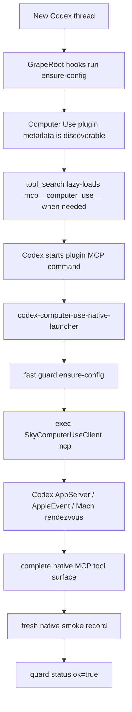

# Architecture

This describes the repair system that restores and validates the native Codex
Computer Use path.

The target machine already has Codex installed. The problem this repo solves is
that native Computer Use is missing from fresh threads, fails to launch, times
out, loses the Codex AppServer rendezvous, or is blocked by broken local plugin
routing. The architecture below keeps the official native Computer Use MCP path
intact and proves it with native tool calls.

For a user-facing explanation of Computer Use, native verification, and
native-versus-fallback boundaries, see `docs/WHAT-IS-COMPUTER-USE.md`.
For the exact upstream capability parity contract and API-action mapping, see
`docs/CAPABILITY-PARITY.md`.

## Why Native Computer Use Is The Target

Native Codex Computer Use is the official OpenAI plugin path for local Mac GUI
control in Codex. It is exposed as MCP tools, keeps the native
`SkyComputerUseClient mcp` process connected to the Codex AppServer rendezvous,
and can produce structured health evidence from real native tool calls.

Official Codex Computer Use setup is still the baseline: install the bundled
Computer Use plugin in Codex, grant normal macOS Screen Recording and
Accessibility permissions, allow target apps in Codex when prompted, and keep
sensitive or disruptive actions under user review. This repair layer does not
replace that model. It repairs the local native route when it drifts, preserves
OpenAI's native client boundary, and fails closed instead of silently using a
fallback.

This is materially different from fallback automation:

- `cliclick` and similar pointer tools move the visible pointer and depend on
  coordinates.
- AppleScript and Accessibility scripting depend on separate app scripting
  surfaces and permissions.
- Keyboard Maestro and Haindy can be useful user-owned workflows, but they are
  external operator paths rather than the native Codex Computer Use server.
- Browser automation and Playwright operate a browser context, not the general
  native Mac Computer Use path.

The architecture therefore restores native routing first and treats every
fallback as explicit operator work. Fallback actions must never be hidden behind
the Computer Use MCP server and must never satisfy `ok=true`.

## Why Repair Is Needed

Fresh Codex sessions depend on several pieces that can drift independently:
tool discovery, plugin enablement, marketplace mirrors, plugin cache,
LaunchServices runtime registration, Codex AppServer rendezvous, the native
client binary, macOS helper prompts, and stale native client processes.

The repair system keeps these pieces in sync from source-owned files under this
repo, installs the runtime into `$HOME/.codex`, and then fails closed unless a
fresh Codex-context smoke proves real native operations.

When the installer is pointed at a non-default Codex app path, it persists that
validated path under `$HOME/.codex/state/computer-use-guard/codex-app-path`.
The guard LaunchAgent and native launcher read that state so Codex restarts and
Mac reboots do not silently fall back to `/Applications/Codex.app`.

## High-Level Flow

## Layers

### 1. User Guidance Layer

Files:

- `~/.codex/skills/macos-computer-use/SKILL.md`
- Official Computer Use plugin MCP metadata under the plugin cache

Responsibilities:

- Make native Computer Use the first path for live Mac GUI work.
- Teach users and agents that this repo repairs native Computer Use; it is not
  a replacement automation stack.
- Teach fresh threads that missing `mcp__computer_use__` is usually lazy-loading
  until `tool_search` has been tried.
- Keep the bundled plugin `skills/` entry suppressed so the UI shows only the
  canonical Computer Use skill.
- Forbid hidden GUI fallbacks inside the Computer Use MCP path.
- Keep OpenAI Codex targeting unambiguous: `/Applications/Codex.app` or
  `com.openai.codex`, never plain `Codex`.

### 2. Codex Config And Plugin Discovery Layer

Files and paths:

- `~/.codex/config.toml`
- `~/.codex/plugins/marketplaces/openai-bundled`
- `~/.codex/.tmp/bundled-marketplaces/openai-bundled`
- Official cached plugin under `~/.codex/plugins/cache/...`

Responsibilities:

- Keep `computer-use@openai-bundled` enabled.
- Keep `chrome@openai-bundled` enabled and cached when the official bundled
  Chrome plugin is present, so extension-backed Chrome discovery does not
  interfere with Computer Use tool discovery.
- Keep Chrome Extension setup separate from native Computer Use health: status
  reads native-host, extension, and force-install policy state; `ensure-config`
  and `ensure` may repair Chrome native-messaging, `ExtensionInstallForcelist`,
  and per-user `External Extensions` state once the bundled Chrome plugin cache
  is healthy.
- Patch the bundled Chrome browser-client cache copy so the official Browser
  Use API can connect to `/tmp/codex-browser-use` directly and keeps
  `type="extension"` backends in its list. This preserves the official Chrome
  plugin API surface; it is not a hidden AppleScript, Playwright, or GUI
  fallback.
- Patch the installed Chrome skill cache copy so agents use the local
  Foundation force-repair path for native host, force-install policy, external
  extension file, and browser-client extension discovery issues. The patched
  skill must select Chrome by the backend id returned from
  `agent.browsers.list()`, because a literal `"extension"` id is not stable
  across all Browser Use runtimes.
- Remove `tool_suggest.disabled_tools` entries for
  `computer-use@openai-bundled` and `chrome@openai-bundled`.
- Keep marketplace mirrors patched so plugin loading uses the local native
  launcher.
- Keep direct `[mcp_servers.computer-use*]` aliases absent. Direct aliases start
  duplicate native clients and were proven dangerous.

### 3. Native Launcher Layer

File:

- `~/.codex/bin/codex-computer-use-native-launcher`

Responsibilities:

- Run `codex-computer-use-guard ensure-config --quiet` quickly.
- `exec` the official patched `SkyComputerUseClient mcp` in the same process.

The `exec` is non-negotiable. Spawning the native client as a child can lose the
Codex AppServer / AppleEvent / Mach rendezvous context, which produces tool
timeouts or broken current-thread transports.

### 4. Guard Layer

File:

- `~/.codex/bin/codex-computer-use-guard`

Main commands:

- `ensure-config`: fast structural repair for hooks, launcher, and LaunchAgent.
- `ensure`: full repair and validation; refreshes stale/missing native smoke
  when structural/runtime readiness exists.
- `status`: full health read without forced repair.
- `fresh-smoke`: authoritative native acceptance smoke through Codex context.
- `record-native-smoke`: records current-thread smoke results.

Responsibilities:

- Config repair.
- Marketplace mirroring.
- Plugin cache repair.
- Runtime copy repair.
- Swift compatibility shim only when runtime probes prove it is needed.
- LaunchServices registration.
- Companion service readiness.
- Duplicate stale process cleanup.
- Notification helper cleanup.
- LaunchAgent and bootstrapper installation.
- Health-layer calculation.
- Authoritative native smoke capture.

### 5. Persistence Layer

LaunchAgent:

- `~/Library/LaunchAgents/io.github.codex-computer-use-foundation.guard.plist`

Bootstrap/backup files:

- `~/Library/Application Support/CodexComputerUseGuard/codex-computer-use-guard-bootstrap`
- `~/Library/Application Support/CodexComputerUseGuard/codex-computer-use-guard.backup`
- `~/Library/Application Support/CodexComputerUseGuard/codex-computer-use-broker.backup`
- `~/Library/Application Support/CodexComputerUseGuard/codex-dialog-autopilot-bootstrap`
- `~/Library/Application Support/CodexComputerUseGuard/codex-dialog-autopilot.backup`

Responsibilities:

- Run fast repair at login.
- Run fast repair every five seconds while loaded.
- Watch Codex config, marketplace, cache, app-bundled plugin, and `~/.codex`
  directory rewrites.
- Restore the guard if the main file is deleted or truncated.

### 5a. Dialog Operator Layer

Files:

- `~/.codex/bin/codex-dialog-autopilot`
- `~/Library/LaunchAgents/io.github.codex-computer-use-foundation.dialog-autopilot.plist`

Responsibilities:

- Accept only narrow allowlisted local dialogs that match routine
  Codex/browser/helper prompts. Strong buttons such as
  allow/open/continue require both an allowlisted helper process and
  allowlisted dialog text; process name alone is not enough.
- Reject denylisted dialog text before any click, even when the process name
  and app text look otherwise routine.
- Exclude generic network/firewall rules, privacy, security, account,
  cloud-permission, payment, TCC, password, and SecurityAgent prompts from
  unattended approval.
- Handle Little Snitch only through a separate restricted Foundation/Codex
  network-prompt path. That path is for this repair system's recurring helper
  prompts after the user has granted local Automation/Accessibility access; it
  is not native Computer Use health and must not approve unrelated firewall
  rules.
- Keep these prompts from blocking future reinstall or first-run flows after
  the one-time macOS Accessibility/Automation permission exists.
- Stay outside the native Computer Use MCP path. This layer is not used to
  prove `ok=true`, does not replace native tools, and must not click arbitrary
  user/account/payment/security dialogs.

### 6. Evidence Layer

Files:

- `~/.codex/state/computer-use-guard/last-status.json`
- `~/.codex/state/computer-use-guard/last-native-smoke.json`
- `~/.codex/state/computer-use-guard/last-native-smoke-unverified.json`

Responsibilities:

- Preserve machine-readable status across Codex restarts.
- Preserve authoritative smoke evidence across fresh threads.
- Distinguish structural health from operational health.
- Fail closed on stale, missing, fallback, unstructured, or non-native evidence.

## Health Semantics

`configured=true` means config, plugin enablement, marketplace routing, cache,
and direct-alias absence are healthy.

`discoverable=true` means the native launcher reports the complete expected MCP
tool surface: `list_apps`, `get_app_state`, `click`,
`perform_secondary_action`, `set_value`, `select_text`, `scroll`, `drag`,
`press_key`, and `type_text`.

`runtime_ready=true` means patched runtime/client/service readiness checks pass.

`appserver_rendezvous=true` means an authoritative Codex-context native smoke
showed real MCP rendezvous.

`operational=true` means the smoke completed real native operations.

`second_mouse_verified=true` means the smoke proved native GUI action evidence,
not just app listing.

The smoke drives Calculator as a low-risk native app-state target. It opens
Calculator in the background with `open -g`, returns focus to Codex when
possible, targets Calculator by bundle id instead of relying on the frontmost
app, requires native `click`, `type_text`, and `press_key` evidence, verifies
the resulting display value, closes Calculator where the native server allows
it, and removes stale
`codex-cu-native-smoke-*.txt` temp files from older releases. Because it is a
real native GUI proof, the native second pointer may still be visible during
the short smoke run.

The smoke is intentionally a safe behavioral subset. It does not drag arbitrary
UI, scroll unknown app content, or set values in user apps just to prove install
health. Full tool-surface parity is checked with native `tools/list`; the smoke
then proves that the official route can perform safe real GUI actions without
fallback automation.

The payload records whether Calculator appeared frontmost during `list_apps`, so
the non-frontmost part of the proof is visible instead of assumed. The proof is
deliberately narrower than a claim that Codex can operate any minimized,
invisible, off-Space, Terminal, Codex, admin, security, privacy, network, or
firewall UI. Those boundaries follow OpenAI's Computer Use app guidance and
remain explicit operator territory.

Duplicate native MCP clients under one Codex AppServer parent are fail-closed
health evidence. The guard cleans orphaned clients automatically. Full
`ensure` also collapses duplicate native transports by keeping the newest
client per AppServer parent and removing older duplicates before reporting
operational health.

`ok=true` requires all of the above.

## Boundary: Native Versus Fallback

The native MCP path may only run the official patched OpenAI Computer Use
client via the native launcher. It may not silently use:

- AppleScript or `osascript`
- Accessibility scripting
- `cliclick`
- Keyboard Maestro
- screenshot-based automation
- Browser/Playwright automation
- VPN/proxy wrappers

Fallbacks can be used only as explicit operator paths when the user asks to keep
going despite native unavailability. They are never allowed to count as native
Computer Use success.
